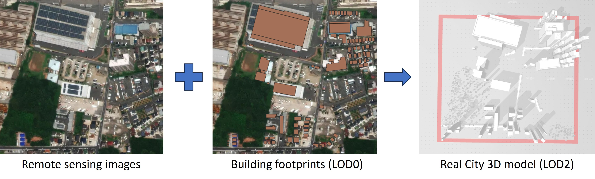

# gen3D_realCity
Input building footprint and generate .obj and CityGML(.gml) files for real city 3D scene

Function impression
----------------

# TODO

- Release the main codes. 
- Improve the vegetation and road extraction performance.
- Improve building generation speed and performance.
- Revise the topological relationship of relief/road/cityFurniture/vegetation